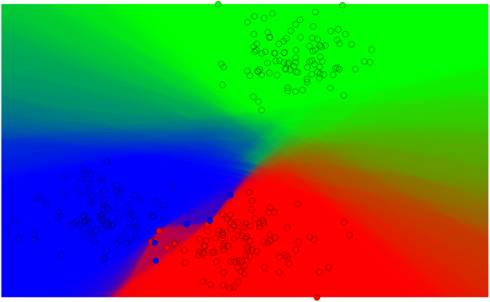

This is a MATLAB wrapper for doing classification using the decision forest framework [1] available at
[http://research.microsoft.com/en-us/projects/decisionforests/]
(http://research.microsoft.com/en-us/projects/decisionforests/) ,
hereinafter referred to as Sherwood.

The training and classification is parallelized.

Visualizing decision boundaries for a three class problem.

Getting started
===

1. MATLAB and a c++ compiler is needed. 

2. Due to the license of Sherwood, you will have to download 
the [source code](http://research.microsoft.com/en-us/projects/decisionforests/) and place it inside /Sherwood/.

3. Setup MATLAB using "mex -setup".

4. An example is available in example.m

All files are compiled automatically

The code has been tested on
* MATLAB 2013a with GCC 4.8 on Ubuntu 13.10.
* MATLAB 2013a with Visual Studio 2013 on Windows 7.

Limitations
===
If you are using a c++ compiler which does not support OpenMP
[http://openmp.org/wp/openmp-compilers/](http://openmp.org/wp/openmp-compilers/),
you need to turn off multi-threaded training by setting "use_openmp = false" in sherwood_train.m.

OpenMP is unfortunately not supported by the c++ compiler recommended by Mathworks for Windows: 
[Microsoft Windows SDK 7.1](http://www.mathworks.se/support/compilers/R2013b/index.html). It is however supported by Visual Studio.

Alternatives
===
There are atleast two popular implementation of random forest available for 
MATLAB [2,3]. 

The main difference with Sherwood are

1. No bagging, so there will be no out-of-bag error et cetera.
2. The probabilities in the leafs are stored as histograms resulting in more accurate probability estimates when averaging over many trees.
3. Entropy is used as split critera for each node.

References
===
1. 
Antonio Criminisi, Jamie Shotton, and Ender Konukoglu
[Decision Forests: A Unified Framework for Classification, Regression, Density Estimation, Manifold Learning and Semi-Supervised Learning]
(http://research.microsoft.com/apps/pubs/default.aspx?id=158806). Foundations and Trends® in Computer Graphics and Vision, 2012.

2. Randomforest-matlab, a Matlab wrapper of a R wrapper of Leo Breiman fortran code
[https://code.google.com/p/randomforest-matlab/](https://code.google.com/p/randomforest-matlab/).

3. Matlab's tree bagger [http://www.mathworks.se/help/stats/treebagger.html]([http://www.mathworks.se/help/stats/treebagger.html).

